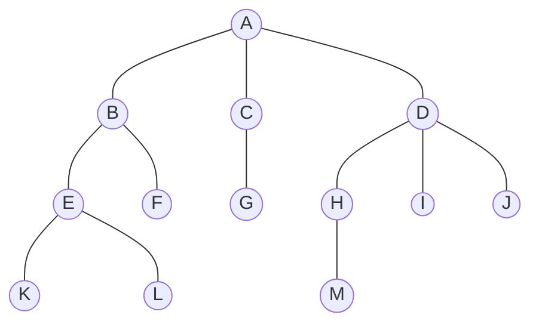

# 数据结构与算法-基础概念

## 数据结构~08.30~

### 数据结构三要素: 逻辑结构, 存储结构, 数据的运算

#### 逻辑结构


- 集合: 数据元素同在一个集合中, 别无其他关系
- 线性结构: 数据元素间只存在一对一的关系
- 树形结构: 数据元素间存在一对多的关系
- 图状结构(网状结构): 存在多对多的关系


#### 存储结构

- 顺序存储: 逻辑上相邻的元素在物理上也位于相邻的存储单元中
  - 优点: 实现随机存取, 每个元素占用最少的内存空间
  - 缺点: 只能使用相邻的一整块存储单元, 可能因此产生较多外部碎片
- 链式存储: 借助指示元素存储地址的指针表示元素间的逻辑关系.
  - 优点: 不会出现碎片现象, 充分利用存储单元
  - 缺点: 存储指针占用额外空间, 只能顺序读取
- 索引存储: 建立附加的索引表. (索引表中的每项称为索引项, 形式是(关键字, 地址) )
  - 优点: 检索快
  - 缺点: 索引表占用额外空间, 修改数据也要修改索引表, 更费时
- 散列存储(哈希(Hash)存储): 根据关键字计算出其内存地址
  - 优点: 检索快, 修改快
  - 缺点: 需要很好的散列函数

#### 数据运算

- 逻辑结构 - 运算的定义, 指出运算的功能
- 存储结构 - 运算的实现, 指出操作步骤

~~*...怎么书后的习题一个都不会做 (学到的与考到的 x)*~~

## 算法~08.30~

算法是对特定问题求解步骤的一种描述, 是指令的有限序列, 其中每条指令表示一个或多个操作.

一个算法应有下列 5 条重要特性: 

- 有穷性: 有穷步骤, 有穷时间
- 确定性: 指令含义确切, 相同输入相同输出
- 可行性: 操作都可以通过已经实现的基本运算执行有限次实现
- 输入: 零或多个, 取自于某个特定对象的集合
- 输出: 一或多个, 与输入有特定关系的量

好算法的目标: 

- 正确性: 正确求解问题
- 可读性: 帮助人们理解
- 健壮性: 对非法数据做出适当的反应或处理
- 效率与低存储量需求: 时间与存储空间, 与问题的规模有关

### 算法效率的度量

#### 时间复杂度

时间复杂度主要分析 T(n) 的数量级

T(n) = O(f(n))

- T(n)是算法中所有语句的频度之和

  - 语句的频度: 该语句在算法中被重复执行的次数

- n: 算法问题规模

- f(n): 算法中基本运算的频度

  - 基本运算: 最深层循环内的语句

- f(n)与T(n)同数量级, 通常采用f(n)分析时间复杂度

- O: T(n)的数量级
  ~~*严格数学定义鸽了*~~

- 时间复杂度还取决于待输入数据的性质

- **取f(n)中随n增长最快的项, 将其系数置为 1 作为度量
- 例如 $f(n) = an^3 + bn^2 + cn$  的时间复杂度为O(n^3)

*总是考虑最坏情况下的平均复杂度, 以保证算法运行时间不会更久*

运算法则:

- 加法:   $T_1(n) + T_2(n) = O(max(f(n), g(n)))$
- 乘法:   $T_1(n) + T_2(n) = O(f(n) * g(n))$

##### **常见渐近时间复杂度**

$$
O(1) < O(log_2(n)) < O(n) < O(nlog_2(n)) < O(n^2) < O(n^3) < O(2^n) < O(n!) < O(n^n)
$$

#### 空间复杂度

S(n) = O(g(n))

- 是问题规模n的函数
- 算法原地工作是指算法所需的辅助空间为常量, 即 O(1)

#### 错点QAQ

- 时间复杂度指渐近时间复杂度, 不要赋特殊值给n


## 数据结构与算法

1. 解决问题方法的效率跟数据的组织方式直接相关

# 线性表~09.10~

## 定义与基操

### 定义

线性表是具有相同数据类型的 n(n>=0) 个数据元素的有限序列, 表示为 $L = (a_1. a_2, ..., a_i, ..., a_n)$

- 表长: n, n=0 时线性表是一个空表
- 表头元素: $a_1$
- 表尾元素: $a_n$
- 逻辑特性: 除第一个元素外, 每个元素有且仅有一个前驱; 除最后一个元素外, 每个元素有且仅有一个后继

特点: 

- 表中元素的个数有限
- 表中元素具有逻辑上的顺序性, 有其先后次序
- 表中元素都是数据元素, 每个元素都是单个元素
- 表中元素的数据类型都相同, 即每个元素占有相同大小的存储空间
- 表中元素具有抽象性, 即仅讨论元素间的逻辑关系, 而不考虑其表示什么内容

线性表与顺序表/链表区别:

- 线性表是一种逻辑结构, 表示元素间一对一的相邻关系
- 顺序表/链表是指存储结构

### 基本操作

| 函数                    | 说明                                                         |
| ----------------------- | ------------------------------------------------------------ |
| `InitLIst(&L)`          | 初始化表, 构造一个空的线性表                                 |
| `Length(L)`             | 求表长, 返回线性表的长度, 即 L 中数据元素的个数              |
| `LocateElem(L, e)`      | 按值查找操作                                                 |
| `GetElem(L, i)`         | 按位查找操作, 获取第 i 个位置的值                            |
| `ListInsert(&L, i, e)`  | 插入操作, 在表 L 的第 i 个位置上插入指定元素 e               |
| `ListDelete(&L, i, &e)` | 删除操作, 删除表 L 第 i 个位置的元素, 并用 e 返回删除元素的值 |
| `PrintList(L)`          | 输出操作, 按前后顺序输出线性表 L 的所有元素值                |
| `Empty(L)`              | 判空操作, 若为空表返回 true                                  |
| `DestoryList(&L)`       | 销毁操作, 销毁线性表并释放 L 占用的内存空间                  |

## 顺序表

### 简介

线性表的顺序存储又称顺序表

线性表是随机存取的存储结构

> 用一组地址连续的存储单元依次存储线性表中的数据元素, 从而使得逻辑上相邻的两个元素在物理位置上也相邻

称 i 为元素 a~i~ 在线性表中的位序

- 线性表中元素的位序从 1 开始, 数组中元素的下标从 0 开始

特点:

1. 表中元素的**逻辑顺序与其物理顺序相同**
2. **随机访问**, 即通过首地址和元素序号可以在 O(1) 内找到指定的元素
3. 存储密度高, 每个结点只存储数据元素
4. 插入和删除操作需要移动大量元素

### 基本操作的实现

1. 插入操作

```cpp
bool ListInsert(SqList &L, int i, ElemType e) {
  if (i<1 || i>L.length+1)		//判断i的范围是否有效
    return false;
  if(L.length >= MaxSize)			//当前存储空间已满, 不能插入
    return false;
  for(int j=L.length; j>=i; j--) 	//第i个元素之后的元素右移
    L.data[j]=L.data[j-1];
  L.data[i-1] = e;						//位置i处放入 e
  L.length++;									//线性表长度+1
  return true;
}
```

- i 与 length 都是从 1 开始的位序
- 平均时间复杂度为O(n), 最坏时间复杂度也是O(n)
  - 计算: $\sum^{n+1}_{i=1} p_i(n-i+1) = \sum^{n+1}_{i=1} \frac{1}{n+1} (n-i+1) = \frac{n}{2}$

2. 删除操作: 引用变量 e 返回

```cpp
bool ListDelete(SqList &L, int i, ElemType &e) {
  if (i<1 || i>L.length+1)		//判断i的范围是否有效
    return false;
  e = L.data[i-1];
  for (int j=i; j<L.length; j++) 
    L.data[j-1] = L.data[j];
  L.length--;
  return true;
}
```

- 平均时间复杂度为O(n)

3. 按值查找(顺序查找): 返回其位序

```cpp
int LocateElem(SqList L, ElemType e) {
  int i;
  for (i=0; i<L.length; i++) 
    if (L.data[i] == e) 
      return i+1;
  return 0;
}
```

- 平均时间复杂度为O(n)

## 单链表~09.13~

### 简介

线性表的链式存储又称单链表

单链表是非随机存取的存储结构

通过一组任意的存储单元来存储线性表中的数据元素

> 为了建立元素之间的线性关系, 对每个链表结点, 除了存放元素自身的信息外, 还需要一个存放其后继的指针

优缺点:

- 不需要大量连续存储单元
- 浪费存储空间
- 不能随机存取

头指针: 指向链表的第一个结点(包括头结点), 为NULL时表示空表
头结点: 在链表第一个结点之前再附加一个结点, 它的结点内不存放信息或者存放表长等

头结点的作用:

- 在链表第一个位置上的操作与其他元素相同, 无须特殊处理
- 无论链表是否为空, 其头指针都是指向头结点的非空指针, 空表与非空表的处理得到统一

### 基本操作的实现

```cpp mark:1,6,7,22-24,40,41,55,62-65,70,71
//结点类型
typedef struct LNode{
    ElemType data;
    struct LNode *next;
}LNode, *LinkList;
//头插法建立单链表(逆向建立): 每次将新结点插入到当前列表的表头
	//每个结点插入的时间为 O(1) , 总时间复杂度 O(n)
LinkList List_HeadInsert(LinkList &L) {
    LNode *s; int x;
    L = (LinkList)malloc(sizeof(LNode)); 	//创建头结点
    L->next = NULL;							//初始为空链表
    scanf("%d", &x);						//输入结点的值
    while (x != 9999) {						//输入999表示结束
        s = (LNode*)malloc(sizeof(LNode));	//创建新结点
        s->data = x;
        s->next = L->next;
        L->next = s;
        scanf("%d", &x);
    }
    return L;
}
//尾插法建立单链表(正向建立): 新结点插入表尾
	//需要增加一个尾指针 r , 使其始终指向尾结点
	//因为有尾指针, 时间复杂度与头插法相同
LinkList List_TailInsert(LinkList &L) {
    LNode *s; int x;
    L = (LinkList)malloc(sizeof(LNode));
    LNode *r = L;
    scanf("%d", x);
    while (x != 9999) {
        s = (LNode *)malloc(sizeof(LNode));
        s->data = x;
        r->next = s;
        r = s;
        scanf("%d", &x);
    }
    r-next = NULL;
    return L;
}
//按序号查找结点值: 返回第 i 个结点或最后一个结点指针域 NULL
	//时间复杂度为 O(n)
LNode *GetElem(LinkList L, int i) {
    int j = 1;
    LNode *p = L->next;
    if (i == 0)								//若 i 为 0 , 返回头结点
        return L;
    if (i < 1)
        return NULL;						//若 i 不合法, 返回 NULL
    while (p && j < 1) {
        p = p->next;
        j++;
    }
    return p;
}
//按值查找结点: 返回该结点的指针, 时间复杂度 O(n)
LNode *LocateElem(LinkList L, ElemType e) {
    LNode *p = L->next;
    while (p != NULL && p->data != e) 
        p = p->next;
    return p;
}
//插入结点
	//先检查插入位置的合法性, 在第 i-1 个结点后插入新的结点
	//时间复杂度 O(n)
//删除结点
p = GetElem(L, i-1);
q = p->next;
p->next = q->next;
free(q);
//求表长: 设置计数器变量
	//若无头结点, 则对于空链表需单独处理
```

## 双链表

在单链表基础上增加指向其前驱的指针 prior

- 单链表访问后继的时间复杂度为 O(1), 访问前驱为O(n)

```cpp mark:1,6,11
//结点类型
typedef struct DNode {
    ElemType data;
    struct DNode *prior, *next;
}DNode, *DLinkList;
//在 p 后插入 s
s->next = p->next;
s->next->prior = s;
s->prior = p;
p->next = s;
//删除 p 后的 q
p->next = q->next;
p->next-prior = p;
free(q);
```

## 循环链表

### 循环单链表

表中最后一个结点的 next 不是 NULL , 而是指向头结点


- 在任意位置执行插入删除都是等价的, 无须判断是否是表尾
- 循环单链表不设头指针, 设尾指针效率更高, 这样操作表尾和表头都是 O(1)

### 循环双链表


- 为空表时, 头结点的 next 与 prior 都等于 L

### 静态链表

借助数组来描述线性表的链式存储结构

- 与顺序表一样, 要预先分配一块连续的存储空间
- 以 next == -1 作为结束标志
- 不如单链表方便, 用于一些不支持指针的高级语言(如Basic)

```cpp
//结构类型
#define MaxSize 50
typedef struct {
    ElemType data;
    int next;
} SLinkList[MaxSize];
```

## 顺序表与链表

*咕咕咕*

# 栈和队列~09.16~

## 栈

只允许在一段进行插入或删除操作的**线性表**

卡特兰数(Catalan) : $\frac 1{n+1} C^n_{2n}$ , n个不同元素进栈的出栈顺序

### 基本概念

栈顶: 线性表允许插入删除的那一端
栈底: 固定的, 不允许插入删除的那一端
空栈: 不含任何元素的空表
操作特性: 后进先出
数学性质: 

```cpp
InitStack(&S);  	//初始化一个空栈
StackEmpty(S);		//判断一个栈是否为空, 是则返回true
Push(&S, x);		//进栈 (若栈未满)
Pop(&S, x);			//出栈 (若栈非空)
GetTop(S, &x);		//读栈顶元素 (若栈非空)
DestroyStack(&S);	//销毁栈, 并释放空间
```

栈是一种操作受限的线性表, 类似于线性表, 有对应的两种存储方式

### 栈的顺序存储

顺序栈: 采用顺序存储的栈; 利用一组地址连续的存储单元存放自栈底到栈顶的数据元素, 同时附一个指针(top)指示当前栈顶元素的位置

```cpp
#define MaxSize 50
typedef struct {
    ElemType data[MaxSize];
    int top;
} SqStack;
```

栈顶指针: 初始时设置 S.top=-1; 栈顶元素 S.data[S.top]
进栈: 栈不满时, 先栈顶指针 +1 , 再送值到栈顶元素
出栈: 栈非空时, 先去栈顶元素值, 再栈顶指针 -1
栈空条件: `S.top == -1`; 栈满条件: `S.top == MaxSize - 1`; 栈长: `S.top + 1`

#### 顺序栈的基本运算

```cpp
//初始化
void InitStack(SqStack &S) {
    S.top = -1;
}
//判栈空
bool StackEmpty(SqStack S) {
    if (S.top == -1) {
        return true;
    } else {
        return false;
    }
}
//进栈
bool Push(SqStack &S, ElemType x) {
    if (S.top == MaxSize - 1) {
        return false;
    }
    S.data[++S.top] = x;
    return true;
}
//出栈
bool Pop(SqStack &S, ElemType &x) {
    if ( StackEmpty(S) ) {
        return false;
    }
    x = S.data[S.top--];
    return true;
}
//读栈顶元素
bool GetTop(SqStack S, ElemType &x) {
    if ( StackEmpty(S) ) {
        return false;
    }
    x = S.data[S.top];
    return true;
}
```

#### 共享栈

让两个顺序栈共享一个一维数组空间, 将两个栈的栈底分别设置在共享空间的两端, 两个栈顶向共享空间的中间延伸, 可以更有效的利用存储空间
链栈没有头结点, Lhead指向栈顶元素

### 栈的链式存储

采用链式存储的栈称为链栈, 便于多个栈共享存储空间和提高效率, 不存在栈满上溢的情况

## 队列

### 基本概念

队列简称队, 也是一种**操作受限的线性表**, 只允许在表的一端进行插入, 另一端进行删除, 操作特性是先进先出

队头(队首) (Front) : 允许删除的一端
队尾 (Rear) : 允许插入的一端

队列常见的基本操作

```cpp
InitQueue(&Q);
QueueEmpty(Q);
EnQueue(&Q, x);
DeQueue(&Q, &x);
GetHead(Q, &x);
```

### 队列的顺序存储

分配一块连续的存储单元, 附设两个指针, 队头指针 front 指向队头元素, 和队尾指针 rear 指向队尾元素的下一个位置

```cpp
#define MaxSize 50
typedef struct {
    ElemType data[MaxSize];
    int front, rear;
} SqStack;
```

### 循环队列

front 指向 MaxSize-1 时, 再前进一个位置就自动到 0 , 利用取余实现 p = (p + 1) % MaxSize

判断队满与队空:

1. 牺牲一个单元:
   队满 : (Q.rear + 1) % MaxSize == Q.front
   队空 : Q.rear == Q.front
   队列中元素个数 : (Q.rear - Q.front +MaxSize) % MaxSize
2. 增设表示数据个数的成员:
   队空 : Q.size == 0
   队满 : Q.rear == Q.front

### 链队列

同时带有队头指针和队尾指针的单链表, 通常设计为带有头结点便于统一插入删除操作

```cpp
typedef struct {
    ElemType data;
    struct LinkNode *next;
}LinkNode;
typedef struct {
    LinkNode *front, *rear;
}LinkQueue;
```

### 双端队列

允许两端都可以进行入队\出队操作的队列

输出受限的双端队列: 两端插入, 一端删除
输入受限的双端队列: 两端删除, 一端插入

## 特殊矩阵的压缩存储~09.23~

如何用最小的内存空间存储同样的一组数据 , 并且能方便提取矩阵中的元素

### 数组的定义

> 数组是由 n(n>=1) 个相同类型的数据元素构成的有限序列, 每个数据元素称为一个数组元素, 每个元素在 n 个线性关系的序号称为该元素的下标, 下标的取值范围称为数组的维界

- 数组与线性表: 数组是线性表的推广, 一维数组可视为一个线性表; 二维数组可视为其元素也是定长线性表的线性表
- 数组一被定义, 其维数和维界就不再改变, 因此数组只有存取和修改

### 数组的存储结构

采用计算机语言中的数组数据类型存储

多维数组存储时有按行优先(通常)和按列优先

### 矩阵的压缩存储

- 压缩存储: 多个值相同的元素指分配一个存储空间, 零元素不分配存储空间, 从而节省存储空间
- 特殊矩阵: 具有许多相同矩阵元素或零元素, 并且这些元素的分布有一定的规律性
  - 常见有对称矩阵, 上\下三角矩阵, 对角矩阵

#### 对称矩阵

矩阵中 $a_{ij} = a_{ji}$ ,  将这个矩阵 $A[1...n][1...n]$ 存放在一维数组 $B[n(n+1)/2]$ 中
即元素 $a_{ij}$ 存放在 $b_k$ 中 $k = \begin{cases} \frac{i(i-1)}{2} + j-1, &i>=j \\	\frac{j(j-1)}{2} + i-1, 	&i<j  \end{cases}$

- 此处 k 从 0 开始

#### 三角矩阵

上\下三角区所有元素都是同一常量, 与对称矩阵存储方法类似, 在最后存储一次常量, 即存储在 $B[n(n+1)/2 + 1]$

- 此处 k 从 0 开始

#### 三对角矩阵

也称带状矩阵, 其中 $|i-j| > 1$ 的元素都为0	k = 2i + j - 3

#### 稀疏矩阵

非零元素非常少, 仅存储非零元素

# 串~09.26~

## 串的定义与实现

### 串的定义

字符串简称串(string) , 是由零或多个字符组成的有限序列, 一般记为 $S = 'a_1a_2\cdots a_n'\text{  }(n>=0)$

- n = 0 时称为空串, 用 $\emptyset$ 表示
- 子串: 串中任意多个连续的字符称为该串的子串, 相应的包含它的是主串
- 位置: 某个字符在串中的序号 (从1开始) , 子串在主串中的位置为子串第一个字符
- 相等: 两个串长度相等, 每个对应位置的字符都相等
- 空格串不是空串

### 串的存储

1. 定长顺序存储: 类似于顺序表, 为每个串分配一个固定长度的存储区, 即定长数组

   - 截断: 串中超过预定义最大长度 (MAXLEN) 部分的值被舍去

   - 串长的表示: 定义额外的变量存储串长; 或加入结束标记字符 "\0" , 此时串长为隐含值

   - 约定在串操作中, 若串值序列长度超过上界 MAXLEN , 则用截断法处理

   - ```cpp
     #define MAXLEN 255
     typedef struct {
         char ch[MAXLEN];
         int length;
     }SString;
     ```

2. 堆分配存储: 一组地址连续的存储单元, 通过 malloc(), free() 等函数动态分配存储空间

   - C语言中, 存在一个称为 "堆" 的自由存储区, 并通过 malloc() 等函数完成动态存储管理

   - ```cpp
     typedef struct {
         char *ch;
         int length;
     }HString;
     ```

3. 块链存储: 每个结点存放 n 个字符, 称为块 , 不同块之间像链表一样链接

   - 每个结点字符数相同, 最后一个结点不满则用 # 补上

### 串的基本操作

- `StrAssign(&T, chars)` : 赋值, 将 chars 赋值给串T
- `StrCopy(&T, S)` : 复制, 由 S 复制得到 T
- `StrEmpty(S)` : 判空, 空则返回 TRUE
- `StrCompare(S, T)` : 比较, 若 S>T , 返回值>0 ; S=T , 返回值=0 ; S<T , 返回值<0 
- `StrLength(S)` : 求串长, 返回 S 的元素个数
- `SubString(&Sub, S, pos, len)` : 求子串, 用 Sub 返回 S 第 pos 个字符起长为 len 的子串
- `ConCat(&T, S1, S2)` : 联接, 用 T 返回 S1, S2 联接成的新串
- `Index(S, T)` : 定位, 若主串 S 存在与子串 T 相同的子串, 返回它第一次出现的位置, 否则为 0
- `ClearString(&S)` : 清空, 将 S 清为空串
- `DestroyString(&S)` : 销毁, 将 S 销毁

**赋值, 比较, 求串长, 联接, 求子串构成串类型的最小操作子集**

## 串的模式匹配- KMP~09.27~

*此处string下标从0开始*

### 暴力模式匹配算法示例

子串的定位操作, 求子串(模式串)在主串中的位置

```cpp 暴力匹配
int Index(SString S, SString T) {
  int i=1, j=1;
  while (i <= S.length && j <= T.length) {
    if (S.ch[i] == T.ch[j]) {		//若这两个字符匹配, 继续比较后续字符
      ++i;
      ++j;
    } else {										//否则指针后退重新开始匹配
      i = i - j + 2;
      j = 1;
    }
  }
  if (j > T.length)
    return i - T.length;
  else
    return 0;
}
```

从主串S的每一个字符起, 与整个模式T匹配

最坏时间复杂度O(nm) 

- 例: 主串S `000000000000000000001` 模式串T `0000001`

### 字符串的前缀, 后缀, 部分匹配值

- 前缀: 除最后一个字符外, 字符串的所有头部子串

- 后缀: 除第一个字符外, 字符串的所有尾部子串

- 部分匹配值: 前缀和后缀的最长的共有元素的长度

- 部分匹配表: 对字符串的每个前缀子串求部分匹配值, 即得它的部分匹配表

  - 'a' 的前缀和后缀都是空集, 部分匹配值为 0

  - 'abab' 的前缀为 {a, ab, aba} , 后缀为 {a, ab, bab } 部分匹配值为 2 

  - 'ababa' 的部分匹配表(PM)

    | S    | a    | b    | a    | b    | a    |
    | ---- | ---- | ---- | ---- | ---- | ---- |
    | PM   | 0    | 0    | 1    | 2    | 3    |
    
    


### KMP算法

匹配过程: 

1. 按照通常的暴力匹配做
2. 出现不匹配时, 子串向后移动的位数 = 已匹配的字符数 - 最后一个匹配字符对应的部分匹配值
3. 子串的对应位置继续与主串的当前位置比较

时间复杂度: O(m+n)

- 构建部分匹配表为 O(n) , 在主串中查找为 O(m)

原理: 模式串的匹配值表示它的首尾有多少重复的字符, 子串首部可以直接跳到下一次匹配的字符

改进: 原过程第二步移动的表达式: `Move = ( j - 1 ) - PM[j-1]`

- 每当匹配失败, 找它的前一个元素的部分匹配值, 可以将PM表左移一位, 直接看它自己的匹配值
  左移后, 原PM[0] = -1 , 原最后一位部分匹配值溢出, 此时式子为 `Move = ( j - 1 ) - PM[j]`
- 将PM值全部 +1 , 原式变为 `Move = j - PM[j]` , 此时next[1] = 0 
  - 此处模式串的位序起始为 1 , 若为 0 则不 +1
- 最后记改进后的PM数组为 next[]

### 求next[j]

$$
next[j]= 
\begin{cases}
	0, &j = 1	\\
	max\{k|1<k<j 且 {'} p_1 \dots p_{k-1} {'} = {'}p_{j-k+1} \dots p_{j-1}{'}\} , &此集合不为空		\\
	1, &其他情况	\\
\end{cases}
$$


1. 由公式, next[1] = 0 ;
2. 设 next[j] = k , 则next[j+1] = ? :
   1. 若 p~k~ = p~j~ , 则在模式串中 'p~1~...p~k~' = 'p~j-k+1~...p~j~' , next[j+1] = k+1
   2. 若 p~k~ != p~j~ , 则在模式串中 'p~1~...p~k~' != 'p~j-k+1~...p~j~' , 此时用前缀 'p~1~...p~k~' 与后缀 'p~j-k+1~...p~j~' 进行模式匹配
      即将 'p~1~...p~k~' 向右滑动至第 next[k] 个字符与 p~j~ 比较, 重复该过程, 不存在长度更短的值则等于 1

```cpp 求next值
void getNext(string T, int next[]){
    int i = 1, j = 0;
    next[1] = 0;
    int m = T.length();
    while (i < m)
    {
        if (j == 0 || T[i] == T[j])
        {
            i++;
            j++;
            next[i] = j;
        } else {
            j = next[j];
        }
    }
}
```

### next 再优化: nextval ~10.07~

若出现 p~j~ = p~next[j]~ , 即执行 next 后的数值与原来匹配失败的数值相等时, 此时下次匹配必然失败, 直接令 next[j] = next[next[j]] , 直至不等

示例: 

| 模式串     | a    | a    | a    | a    | b    |
| ---------- | ---- | ---- | ---- | ---- | ---- |
| j          | 1    | 2    | 3    | 4    | 5    |
| next[j]    | 0    | 1    | 2    | 3    | 4    |
| nextval[j] | 0    | 0    | 0    | 0    | 4    |

# 树与二叉树

## 先来一个考纲与框架~09.01~


## 基本概念~09.01~

### 树的定义

树是n $(n>=0)$ 个结点的有限集. 当 n=0 时, 称为空树. 非空树满足:

- 有且仅有一个 特定的称为根 的结点
- 当 n>1 时, 其余结点可分为 m(m>0) 个互不相交的有限集 T~1~, T~2~, ..., T~m~, 其中每个集合本身又是一棵树, 称为根的子树

**树的定义是递归的, 即在树的定义中又用到了其自身, 树是一种递归的数据结构**

树作为一种逻辑结构, 也是一种分层结构, 具有两个特点:

​	① 树的根结点没有前驱, 此外所有结点有且仅有一个前驱

​	② 树中所有结点可以有零或多个后继

### 基本术语

#### 树形表示


1. 对某一结点K而言: ( A 是根 )
   	祖先: A 到 K 唯一路径上的任意结点
   	子孙: 相对于祖先
   	双亲(父): A 到 K 路径上最接近 K 的结点
   	孩子(子): 相对于双亲
   	兄弟: 有相同双亲的结点
   	堂兄弟: 双亲在同一层的结点
2. 结点的度: 这个结点的孩子个数
   树的度: 树中结点的最大度数
3. 分支结点: 度大于 0 ( 非终端结点 )
   叶子结点: 度为 0  ( 终端结点 )
4. 结点的层次如上图
   结点的深度: 从根结点开始自顶而下逐层累加
   结点的高度与深度相反
   树的高度/深度是最大结点高度/深度
5. 有序树: 各子树从左到右有次序, 不能互换
   无序树: 相对于有序树
6. 路径: 两个结点之间的路径是由这它们之间所经过的结点序列构成的, **树中的路径从上而下**
   路径长度: 路径上所经过的边的个数
   树的路径长度: 树根到每个结点的路径长度的总和
7. 森林: m(m>=0) 棵**互不相交**的树的集合. 

### 树的性质

最基本的四条性质:

1. 结点数等于所有结点度数之和加 1 
2. 度为 m 的树中第 i 层上至多有m^i-1^个结点 (i>=1)
3. 高度为 h 的 m 叉树至多有 ( m^h^ - 1 ) / ( m - 1 ) 个结点
   - 推导: 对 $1 + m + m^2 + ... + m^{h-1}$ 求和即得 (满叉树)
4. 具有 n 个结点的 m 叉树的最小高度为 [ log~m~(n(m-1) +1) ] 
   - 推导: 逆推上式

*顺带尝试画个树图, ~~为什么显示不出来~~
原来没关默认代码高亮.  **~(顺带关了之后需要把之前的mermaid重写一遍)~**




## 二叉树~09.01~

### 逻辑结构

#### 二叉树的定义

与树类似, 二叉树也以递归的形式定义
二叉树是n(n>=0)个结点的有限集合:

- 或者为空二叉树, 即 n=0 ,
- 或者由一个根结点和两个互不相交的被称为根的左子树和右子树组成. 左子树和右子树又分别是一棵二叉树

二叉树的特点:

- 每个结点至多有两棵子树 (即不存在度大于 2 的结点)
- 二叉树是有序树, 有左右子树之分, 次序不能任意颠倒
  **即使树中结点只有一棵子树, 也要区分它的左右**

二叉树与度为 2 的有序树的区别:

- 度为 2 的有序树至少有三个结点, 
  二叉树可以为空
- 度为2的有序树的孩子的左右次序是相对于另一孩子而言, 若某个结点只有一个孩子, 其无须区分左右次序
  二叉树无论孩子数是否为 2 , 都需确定其左右次序
  即二叉树的结点次序不是相对于另一结点而言, 而是确定的

#### 一些特殊的二叉树

- 满二叉树: 高为 h , 且含有 2^h^-1 个结点的二叉树

  - 树中的每层都含有最多的结点

  - 叶子结点都集中在二叉树的最下一层

  - 除叶子结点外每个结点的度数都是2

  - **对满二叉树按层序编号:** 从根结点编号为 1 起, 自上而下, 从左向右
    则对于编号为 i 结点, 若有双亲, 其双亲为 i/2 ; 若有左孩子, 为 2i , 若有右孩子, 为 2i+1

    ```mermaid
    graph TB
    
    1((1))---2((2))
    1((1))---3((3))
    2((2))---4((4))
    2((2))---5((5))
    3((3))---6((6))
    3((3))---7((7))
    4((4))---8((8))
    4((4))---9((9))
    5((5))---10((10))
    5((5))---11((11))
    6((6))---12((12))
    6((6))---13((13))
    7((7))---14((14))
    7((7))---15((15))
    ```

- 完全二叉树: 高为 h , 有n个结点, 并且每个结点都与高为 h 的满二叉树中编号为 1~n 的结点一一对应的二叉树
  - 

- 二叉排序树: 左子树上所有结点的关键字均小于根结点的关键字; 右子树上所有结点的关键字均大于根结点的关键字; 左子树和右子树又各是一棵二叉排序树. 

- 平衡二叉树: 树上任一结点的左子树和右子树的深度之差不超过 1 

#### 二叉树的性质

- 非空二叉树上的叶子结点数等于度为 2 的结点数加 1 , 即 n~0~=n~2~+1 
  证明: ( 记度为 i 的结点数为 n~i~ ) $\begin{cases} n = n_0 + n_1 + n_2 \\ n = n_1 + 2*n_2 \\ \end{cases}$
- **非空二叉树**第 k 层至多有 2^k-1^ 个结点
- 高度为 h 的二叉树至多有 2^k^-1 个结点
- 具有 n(n>0) 个结点的完全二叉树的高度为 $\log_2(n+1)$ 或 $\log_2n+1$ 
  - 两个式子的值相等
  - 分别由 $2^{h-1}<n\leq2^h-1$ 或 $2^{h-1}\leq n<2^h$ 推出

- 

### 存储结构~09.02~

#### 顺序存储结构

​	用一组地址连续的存储单元依次自上而下, 自左至右存储完全二叉树上的结点元素. 即将完全二叉树上编号为 i 的结点元素存储在一堆数组下标为 i-1 的分量中.

- 优势: 由完全二叉树和满二叉树适合采用顺序存储
  树中结点的序号可以唯一反映结点之间的逻辑关系. 既能最大地节省空间, 又能利用数组元素的下标值确定结点在二叉树中的位置, 以及结点之间的关系.
- 劣势: 一般的二叉树需要添加一些并不存在的空节点, 才能使数组下标反映二叉树中结点之间的逻辑关系
  在最坏情况下, 高为 h 且只有 h 个结点的单支树需要占据近 2^h^-1 个存储单元. 
  通常情况如下图:
  
- **此存储方式建议从数组下标 1 开始存储, 而不是 0 **

#### 链式存储结构

**顺序存储的空间利用率较低, 一般都采用链式存储结构**

用链表结点来存储二叉树的每个结点, 结点结构通常包括若干数据域与指针域
如二叉链表至少包含三个域: 数据域data, 左指针域lchild, 又指针域rchild. 其链式存储结构描述如下

```cpp
typedef struct BiTNode{
  ElemType data;
  struct BiTNode *lchild, *rchild;
}BiTNode, *BiTree;
```

- 易得在含有 n 个结点的二叉链表中, 含有 n+1 个空链域

### 树与森林 与 二叉树相互转换~09.06~

#### 树 → 二叉树

1. 加线: 在所有兄弟结点之间加一条线
2. 抹线: 对树中的每个结点，只保留他与第一个孩子结点之间的连线，删除它与其它孩子结点之间的连线
3. 旋转: 以树的根结点为轴心，将整棵树顺时针旋转一定角度，使之结构层次分明

示例:

#### 森林 → 二叉树

1. 先把每棵树转换为二叉树
2. 第一棵二叉树不动，从第二棵二叉树开始，依次把后一棵二叉树的根结点作为前一棵二叉树的根结点的右孩子结点，用线连接起来。当所有的二叉树连接起来后得到的二叉树就是由森林转换得到的二叉树。

示例: 

#### 二叉树 → 树

1. 若某结点的左孩子结点存在，将左孩子结点的右孩子结点、右孩子结点的右孩子结点……都作为该结点的孩子结点，将该结点与这些右孩子结点用线连接起来
2. 删除原二叉树中所有结点与其右孩子结点的连线
3. 整理（1）和（2）两步得到的树，使之结构层次分明

示例: 

#### 二叉树 → 森林

与之前类似, 是`森林 → 二叉树`的逆过程

## 二叉树的遍历和线索二叉树~09.06~

### 二叉树的遍历

**遍历是二叉树各种操作的基础, 可以在遍历的过程中对结点进行各种操作**

> 二叉树的遍历是指按某条搜索路径访问树中的每一个结点, 使得每个结点均被访问一次, 且仅被访问一次
> 需要寻找一种规律, 以便二叉树上的结点能排列在一个队列上, 进而便于遍历

####  常见的三个遍历顺序

先序 NLR , 中序 LNR , 后序 LRN

先序遍历 PreOrder : 若二叉树为空, 则什么都不做, 否则: 

1. 访问根结点
2. 先序遍历左子树
3. 先序遍历右子树

对应递归算法: 

```cpp
void ProOrder(BiTree T) {
    if (T!=NULL) {
        visit(T);					//访问根结点
        PreOrder(T->lchild);		//递归遍历左子树
        PreOredr(T->rchild);		//递归遍历右子树
    }
}
```

中序遍历 InOrder : 若二叉树为空, 则什么都不做, 否则: 

1. 中序遍历左子树
2. 访问根结点
3. 中序遍历右子树

对应递归算法: 

```cpp
void InOrder(BiTree T) {
    if (T!=NULL) {
        InOrder(T->lchild);		//顺序遍历左子树
        visit(T);				//访问根结点
        InOrder(T->rchild);		//递归遍历右子树
    }
}
```

后序遍历 PostOrder : 若二叉树为空, 则什么都不做, 否则: 

1. 后序遍历左子树
2. 后序遍历右子树
3. 访问根结点

对应递归算法: 

```cpp
void PostOrder(BiTree T) {
    if(T!=NULL) {
        PostOrder(T->lchild);
        PostOrder(T->rchild);
        visit(T);
    }
}
```

三种算法的递归顺序相同

时间复杂度都为O(n) : 每个结点都访问且仅访问一次

最坏情况下的空间复杂度都是O(n) : 递归工作栈的栈深恰好为树的深度

#### 递归算法与非递归算法的转换

以 InOrder 为例: 访问到的结点依次入栈, visit时出栈


*后序遍历的非递归实现较难, 咕了*

#### 层次遍历

对二叉树自上而下, 从左向右依次访问

> 借助一个队列. 先将二叉树根结点入队, 然后出队, 访问出队结点, 若它有左子树, 则将左子树根结点入队; 若它有右子树, 则将右子树根结点入队; 然后出队, 访问出队结点......如此反复, 直至队列为空

模板: 

```cpp
void LevelOrder(BiTree T) {
    InitQueue Q;						//初始化辅助队列
    BiTree P;							//遍历指针p
    EnQueue(Q, T);						//将根结点入队
    while(!IsEmpty(Q)) {				//队列不空则继续
        DeQueue(Q, p);					//队头结点出队
        visit(p);						//访问出队结点
        if(p->lchild!=NULL) {
            EnQueue(Q, p->lchild);		//左子树不空, 则左子树根结点入队
        }
        if(p->rchild!=NULL) {
            EnQueue(Q, p->rchild);		//右子树不空, 则右子树根结点入队
        }
    }
}
```

#### 由遍历序列构造二叉树

由二叉树的 中序序列+先序序列 || 中序序列+后序序列 || 中序序列+层序序列 都可以唯一的确定一棵二叉树, **先序序列+后序序列无法唯一确定一棵二叉树**

### 线索二叉树~09.11~

> 若无左子树, 令 lchild 指向其前驱结点, 若无右子树, 令 rchild 指向其后继结点. 

此外还需增加两个标志域, 标识指针域是指向左(右)孩子还是指向前驱(后继)

结点结构: 

标志域为 0 表示孩子, 为 1 表示前驱后继

线索二叉树 Node 示例:

```cpp
typedef struct ThreadNode {
    ElemType data;
    struct ThreadNode *lchild, *rchild;
    int ltag, rtag;
}ThreadNode, *ThreadT
```

#### 中序线索二叉树

在中序遍历的过程中, 检查 p 的左指针是否为空, 若为空就将它指向 pre ; 右指针同理指向p

```cpp mark:1,17,26,27,32,37
//递归算法 : 
void InThread(ThreadTree &p, ThreadTree &pre) {
  if (p != null) {
    InThread(p->lchild, pre);			//递归线索化左子树
    if (p->lchild == null) {			//左子树为空, 则建立前驱线索
      p->lchild = pre;
      p->ltag = 1;
    }
    if (pre != NULL && pre->rchild == NULL) {
      pre->rchild = p;						//建立前驱结点的后继元素
      pre-rtag = 1;
    } 
    pre = p;
    InThread(p->rchild, pre);
  }
}
//建立中序线索二叉树 : 
void CreateInThread(ThreadTree T) {
  ThreadTree pre = NULL;
  if (T != NULL) {					//非空二叉树, 线索化
    InThread(T, pre);				//线索化二叉树
    pre->rchild = NULL;			//处理遍历的最后一个结点
    pre->rtag=1;
  }
}
//遍历中序线索二叉树 :
	//求中序序列下的第一个结点 : 最左下打的结点(不一定叶结点)
ThreadNode *FirstNode(ThreadNode *p) { 		
  while (p->ltag == 0) p = p->lchild;
  return p;
}
	//求结点p在中序序列下的后继 : 
ThreadNode *NextNode(ThreadNode *p) {
  if (p->rtag == 0) return FirstNode(p-rchild);
  else return p-rchild;
}
	//中序遍历算法 : 
void InOrder(ThreadNode *T) {
  for (ThreadNode *p = FirstNode(T); p != NULL; p = NextNode(p))
    visit(p);
}
```

为了方便, 可以在二叉树的线索链表上添加一个头结点, 其 lchild 指向根结点, rchild 指向中序遍历时最后一个结点, 再令中序遍历时第一个结点的 lchild 和最后一个结点的 rchild 都指向头结点, 好比为二叉树建立了一个双向线索链表

#### 先序与后序~09.12~

先序找后继: 若有左孩子, 则左孩子就是其后继; 若无, 则右孩子就是其后继; 再无, 其右链域直接指示了结点的后继

后续稍复杂点: 

1. 若是根结点, 则其后继为空
2. 若是双亲的右孩子, 或者是双亲的左孩子且双亲没有右子树, 则其后继为双亲
3. 若是双亲的左孩子且双亲有右子树, 其后继为双亲的右子树上按后序遍历出的第一个结点

- 可见后序线索二叉树上找后继时需要知道结点双亲, 即采用带标志域的三叉链表作为存储结构

## 树, 森林~09.13~

### 树的存储结构

#### 双亲表示法

采用一组连续空间来存储每个结点, 同时在每个结点中设置一个伪指针, 指示其双亲结点在数组中的位置

- 根结点下标为0, 其伪指针域为 -1
- 求结点的孩子时需要遍历整个结构

#### 孩子表示法

将每个结点的孩子结点都用单链表链接起来形成一个线性结构

- 此时 n 个结点就有 n 个孩子链表(叶子结点的孩子链表为空表)
- 找子女直接, 找双亲需要遍历

#### 孩子兄弟表示法

又称二叉树表示法, 以二叉链表作为树的存储结构, 每个结点包括三部分内容: 结点值,指向结点第一个孩子的指针,指向下一个兄弟结点的指针(nextsibling)

- 方便实现转换为二叉树的操作
- 易于寻找孩子结点
- 查找双亲较麻烦, 可以为每个结点增设一个parent域


### 树, 森林, 二叉树的转换

[转换规则见上](#树与森林 与 二叉树相互转换~09.06~)

### 树和森林的遍历~09.14~

#### 树的遍历

1. 先根遍历: 若树非空, 先访问根结点, 再依次遍历根结点的每棵子树, 遍历子树时遵循先根后子树的规则, 其遍历序列与这棵树相应二叉树的先序序列相同
2. 后根遍历(中根遍历): 若树非空, 先依次遍历根结点的每棵子树, 再访问根结点, 遍历子树时遵循先子树后根的规则, 其遍历顺序与这棵树相应二叉树的中序序列相同

树的层次遍历与二叉树的层次遍历思想基本相同

#### 森林的遍历

按照树与森林相互递归的定义, 可得

1. 先序遍历森林: 若森林非空, 访问第一棵树的根节点, 先序遍历第一棵树中根节点的子树森林, 先序遍历除去第一棵树之后剩余的树构成的森林
2. 中序遍历森林: 若森林非空, 中序遍历森林中第一棵树的根节点的子树森林, 访问第一棵树的根结点, 中序遍历除第一棵树之后剩余树构成的森林

森林的先序和中序遍历即为其对应二叉树的先序和中序遍历

### 树的应用-并查集

并查集是一种简单的集合表示, 它支持以下三种操作:

- `Union(S, Root1, Root2)` 把集合 S 中的子集合 Root2 并入子集合 Root1
  要求 Root1 与 Root2 互不相交, 否则不执行合并
- `Find(S, x)` 查找集合 S 中单元素 x 所在的子集合, 并返回该子集合的名字
- `Initial(S)` 将集合 S 中的每个元素都初始化为只有一个单元素的子集合

用树(森林)的双亲表示作为并查集的存储结构, 每个子集合以一棵树表示, 所有表示子集合的树, 构成表示全集合的森林, 存放在双亲表示数组内
用数组元素的下标代表元素名, 用根结点的下标代表子集合名, 根结点的双亲为负数
例: 有一个全集合为S = {0, 1, 2, 3, 4, 5, 6, 7, 8, 9} , 初始化时每个元素自成一个单元素子集合, 每个子集合的数值组为 -1 , 之后经过一些计算, 这些子集合合并为 3 个更大的子集合 S~1~ = {0, 6, 7, 8} , S~2~ = {1, 4, 9} , S~3~ = {2, 3, 5} 此时并查集的树形表示和存储结构如图: 


示例:

```cpp mark:3,9,16
#define SIZE 100
int UFSets[SIZE];		//集合双亲数组(双亲指针数组)
//并查集的初始化操作
void Initial(int S[]) {
  for (int i = 0; i < size; i++) {
    S[i] = -1;
  }
}
//Find操作(在并查集中查找并返回元素 x 的根)
int Find(int S[], int x) {
  while (S[x] > 0) {
    x= S[x];
  }
  return x;
}
//Union操作(求两个不相交集合的并集)
void Union(int S[], int Root1, int Root2) {
  //要求 Root1 与 Root2 不同, 且是子集合的名字
  S[Root2] = Root1;		//将根 Root2 连接到另一根 Root1 下面
}
```

## 树与二叉树的应用

### 二叉排序树(二叉查找树)(BST)

或者是一棵空树, 或者是具有以下性质的二叉树:

- 若左子树非空, 则左子树上所有结点的值均小于根结点的值
- 若右子树非空, 则右子树上所有结点的值均大于根结点的值
- 左右子树也分别是一棵二叉排序树

即 左子树结点值 < 根结点值 < 右子树结点值, **对二叉排序树进行中序遍历, 可以得到一个递增的有序序列**

查找: **从根结点开始, 沿某个分支逐层向下比较的过程**; 若二叉排序树非空, 先将给定值与根结点的关键字比较, 若相等, 则查找成功, 若小于根结点的关键字, 则在根结点的左子树上查找, 否则在右子树上查找

```cpp mark:1
//二叉排序树的非递归算法
BSTNode *BST_Search(BiTree T, ElemType key) {
  while (T != NULL && key != T->data) {
    if (key < T->data) {
      T = T->lchild;
    } else {
      T = T->rchild;
    }
    return T;
  }
}
```

插入: 若原二叉排序树为空, 直接插入; 若关键字 k 小于根结点值, 插入到左子树, 若关键字大于根结点值, 插入到右子树

- 插入的结点一定是一个新添加的叶结点, 且是查找失败时的查找路径上访问的最后一个结点的左孩子或右孩子

```cpp
int BST_Insert(BiTree &T, KeyType k) {
  if (T == NULL) {
    T = (BiTree)malloc(sizeof(BSTNode));
    T->key = k;
    T->lchild = T->rchild = NULL;
    return 1;			//返回 1 , 表示插入成功
  } else if (k == T->key) {
    return 0;
  } else if (k < T->key) {
    return BST_Insert(T->lchild, k);
  } else {
    return BSE_Insert(T->rchild, k);
  }
}
```

构造: 从一棵空树出发, 依次输入元素, 将它们插入二叉排序树的合适位置

```cpp
void Creat_BST(BiTree &T, KeyType str[], int n) {
  T = NULL;
  for (int i = 0; i < n; i++) {
    BST_Insert(T, str[i]);
  }
}
```

删除: 先把被删除结点从链表上摘下, 将因删除结点而断开的二叉链表重新链接起来, 同时确保二叉排序树的性质不会丢失, 有以下三种情况

1. 叶结点 z 直接删除
2. 若结点 z 只有一棵左子树或右子树, 则让 z 的子树成为 z 父结点的子树, 替代 z 的位置
3. 若结点 z 有左右两棵子树, 令 z 的直接后继(或直接前驱)替代 z , 然后从二叉排序树中删去这个直接后继(直接前驱), 这样就转换成了第一或第二种情况 (找中序第一个子女填补)

#### 二叉排序树的查找效率~09.17~

平衡二叉树: 左右子树的高度之差的绝对值不超过 1 的二叉排序树
此时平均查找长度为 O(log~2~n) 

若二叉排序树是只有左\右孩子的单支树(类似有序的单链表) , 平均查找长度为 O(n)

### 平衡二叉树

为避免树的高度增长过快, 降低二叉排序树的性能, 规定在插入和删除二叉树时, 要保证任意结点的左右子树高度差的绝对值不超过1, 这样的二叉树成为平衡二叉树, 简称平衡树

平衡因子: 该结点左子树与右子树的高度差 (值为-1, 0, 1)

#### 平衡树的插入

先检查其插入路径上的结点是否因此不平衡, 若导致不平衡, 则先找到插入路径上离插入结点最近的平衡因子的绝对值大于1的结点A(最小不平衡子树) , 再对以 A 为根的子树, 保持二叉排序树特性的前提下, 调整结点使之平衡

调整方法: 

1. LL 平衡旋转(右单旋转) : 在结点 A 的左孩子(L)的左子树(L)上插入新结点, 导致A的平衡因子从 1 增至 2 , 以 A 为根的子树失去平衡, 需要一次向右的旋转操作, 将 A 的左孩子 B 向右上旋转代替 A 成为根结点, 将 A 向右下旋转成为 B 的右子树的根结点, 而 B 的原右子树作为 A 结点的左子树
   

2. RR 平衡旋转(左单旋转) : A 的平衡因子由 -1 减至 -2 , 情况与右单旋转类似
3. LR 平衡旋转(先左后右双旋转) : 在 A 的左孩子的右子树上插入新结点 , 导致 1 增至 2 , 先将 A 结点的左孩子 B 的右子树的根结点 C 向左上旋转提升到 B 结点的位置, 再把该 C 结点右上旋转提升到 A 结点的位置
   

4. RL 平衡旋转(先右后左双旋转) : 类似于LR

#### 平衡树的查找

有 n 个结点的平衡树最大深度为O(log~2~n) , 平均查找长度为 O(log~2~n)

### 哈夫曼树和哈夫曼编码

结点的权: 树中结点被赋予的一个表示某种意义的数值
结点的带权路径长度: 从树的根到任意结点的路径长度与该结点上权值的乘积
树的带权路径长度: 树中所有 **叶结点** 的带权路径长度之和 , 记为 $WPL = \sum^n_{i=1} w_il_i$ , 式中 w~i~ 是第 i 个结点所带的权值, l~i~ 是该叶结点到根结点的路径长度

哈夫曼树(最优二叉树) : 含有 n 个结点的二叉树中, WPL 最小的二叉树

构造哈夫曼树:

1. 将 n 个结点分别作为 n 棵仅含一个结点的二叉树, 构成森林 F
2. 构造一个新结点, 从 F 中选取两棵根结点权值最小的树作为新结点的左右子树, 并将新结点的权值置为左右子树根结点权值之和
3. 从 F 中删除刚才选出的两棵树, 同时将新得的树加入 F 中
4. 重复步骤2, 3, 直至 F 中只剩下一棵树


哈夫曼树特点:

- 每个初始结点都会成为叶结点, 权值越小路径越长
- 构造过程中新建 n-1 个结点, 总结点数 2n-1
- 每次构造都选择两棵树作为新结点的孩子, 不存在度为 1 的结点

哈夫曼编码: 数据压缩编码

# 查找

## 基本概念
